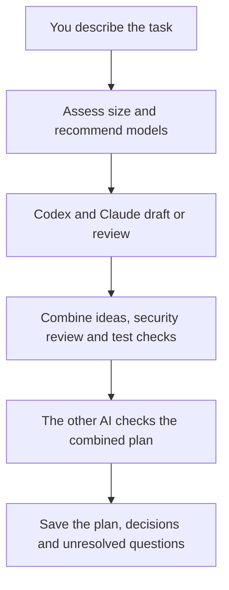

# Codex–Claude Council

**Let Codex and Claude review each other's ideas before you build.**

Start in either app. Describe a feature or project. Get one plan with security considerations, test checks, and a record of the decisions. The skill recommends suitable models but keeps your settings unchanged unless you ask.

[Install](#install) · [Use it](#use-it) · [How it works](#how-it-works) · [Help](docs/SETUP.md)

## Install

### 1. Get the required tools

Install [Node.js](https://nodejs.org/en/download) **18 or newer**, then install and sign in to the **other AI's command-line tool (CLI)**:

| Where you will use the skill | What must work in your terminal | Sign in if needed |
|---|---|---|
| Codex | [Claude Code CLI](https://code.claude.com/docs/en/quickstart) | `claude auth login` |
| Claude Code | [Codex CLI](https://learn.chatgpt.com/docs/codex/cli) | `codex login` |
| Both directions | Both CLIs above | Both commands above |

Already have these tools installed and signed in? Continue below. The skill installer only installs the skill; it does not install these tools or sign you in.

### 2. Download this skill

With Git installed, paste this into **PowerShell on Windows** or **Terminal on macOS/Linux**:

```sh
git clone https://github.com/ZiadHassanein/codex-claude-council.git
cd codex-claude-council
```

Without Git, [download the ZIP](https://github.com/ZiadHassanein/codex-claude-council/archive/refs/heads/main.zip), extract it, and open a terminal in the extracted folder containing `README.md` and `scripts`.

### 3. Install and check

In that same terminal, run:

```sh
node scripts/install.mjs
node scripts/council.mjs doctor
```

No `npm install` is needed. The installer adds the skill for both apps for your current user.

The setup check prints a report. Look for the line matching the app you will use:

| Starting from | Required result |
|---|---|
| Codex | `"codex_chat_ready": true` |
| Claude Code | `"claude_chat_ready": true` |

You only need your chosen direction to be ready. This checks setup and sign-in; it does not send a planning request. If it says `false`, use the [troubleshooting guide](docs/SETUP.md#troubleshooting).

### 4. Open a new chat

Open **your project** in Codex or Claude Code and start a new chat so it can discover the skill. Paste one of the prompts below **into the chat**, not the terminal.

## Use it

**In Codex:**

```text
Use $codex-claude-council to plan a search filter for this app.
Keep it focused. Include security checks and acceptance tests.
```

**In Claude Code:**

```text
/codex-claude-council Plan a search filter for this app with Codex.
Keep it focused. Include security checks and acceptance tests.
```

Replace “a search filter” with your task. Include useful files, constraints, and what success should look like. The AI handles the discussion commands and saves the results.

| Your task | Add this to your request |
|---|---|
| Small feature | “Give me concise steps, edge cases, and acceptance checks.” |
| A design with alternatives | “Have both agents draft independently and compare approaches.” |
| A whole project | “Define the MVP, architecture, milestones, and a detailed first milestone.” |
| An existing plan | “Review the plan in `docs/plan.md` and explain what should change.” |

For model advice without starting a discussion: “Assess this task and recommend models. Keep my settings; advice only.”

## How it works



Your current chat leads the process and calls the other AI. A focused review uses **2 successful peer calls**; independent design or project planning uses **3**. Both include a security review. Model advice does not switch models automatically.

## What you get

The AI gives you links to a saved run folder. Start with these files:

| File | What it tells you |
|---|---|
| `final-plan.md` | What to build, in what order, and how to check it. |
| `RESULT.md` | After completion: review outcome, remaining issues, and edits made after review. |
| `TASK_ASSESSMENT.md` | Task size, risk, and model recommendations. |
| `HANDOFF.md` | Where work stopped and how to continue. |

The folder also keeps the security review and detailed decisions. An optional implementation brief can hand off one milestone.

**Planning does not build or deploy your project.** Tests in a plan are proposed checks unless explicitly reported as executed. Security review highlights risks and unknowns; it does not certify the implementation.

## Help and details

- [Setup, troubleshooting, updates, and usage limits](docs/SETUP.md)
- [Agent instructions](SKILL.md) · [Technical protocol](references/protocol.md)
- [Development notes and recorded test results](PROJECT_NOTES.md)

Peer calls use your provider account and its usage limits. Only selected context is sent to the other provider; exclude secrets and unrelated private information. See the [usage details](docs/SETUP.md#usage-and-privacy).

[MIT license](LICENSE).
