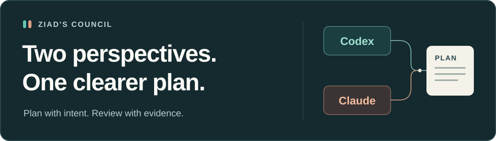
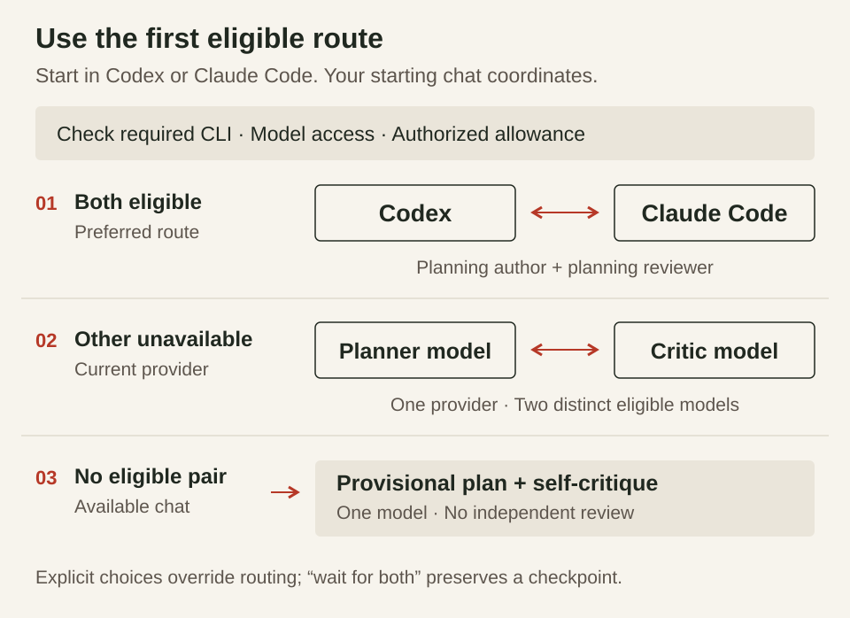
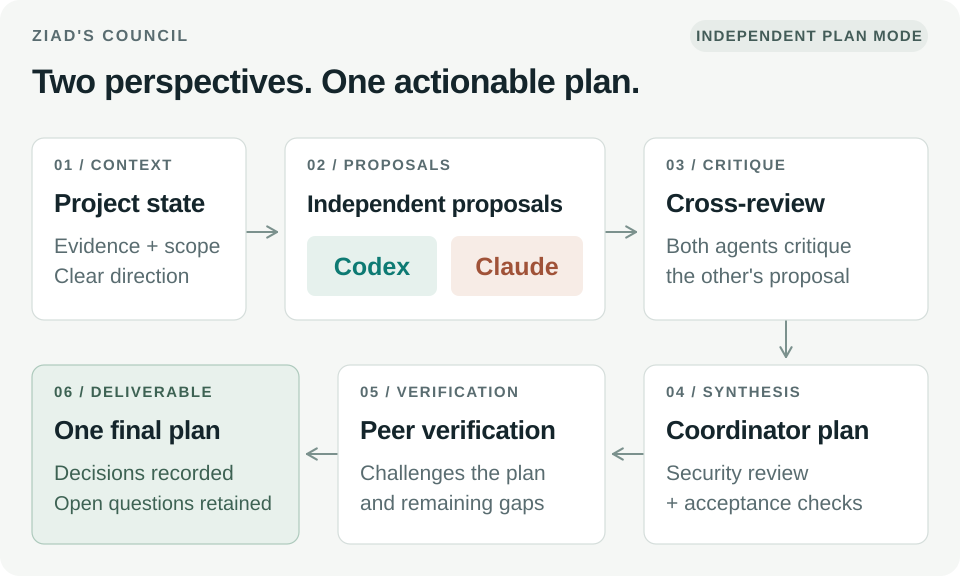
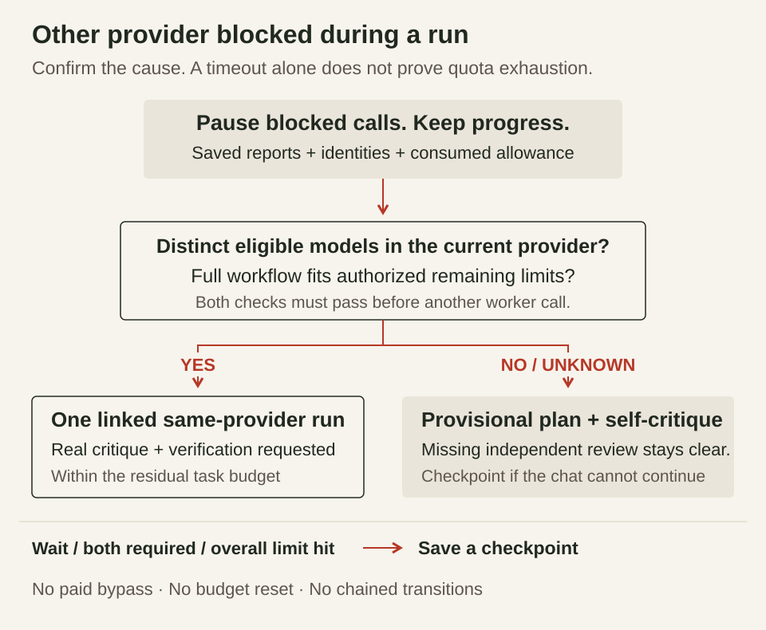

<picture>
  <source media="(max-width: 640px)" srcset="docs/assets/cover-mobile.svg">
  
</picture>

# C2C — planning with Codex and Claude Code

**Plan, challenge decisions, and choose where to start.** Use Codex, Claude Code, or both.

[](https://github.com/ZiadHassanein/C2C/actions/workflows/test.yml)

[**Version 1.2.1**](CHANGELOG.md) · **Windows · Linux · macOS** · **Node.js 18+** · **No npm dependencies** · [**MIT license**](LICENSE)

[Install](#install) · [First request](#use-it) · [Your plan](#what-you-receive) · [Workflow](#how-it-works) · [Update](#update) · [Uninstall](docs/SETUP.md#uninstall) · [Help](#need-help)

<details>
<summary>What C2C does and who coordinates</summary>

**A planning skill that turns your brief into a plan with evidence-based critique.** C2C checks the project, asks important questions, compares proposals, and records decisions, security considerations, tests, and a clear starting point for implementation.

Start in **Codex with `$C2C`** or **Claude Code with `/C2C`**. **The chat you start coordinates the work.** Either provider can lead, and your chat model stays unchanged.

**Use what is already available.** C2C prefers an eligible Codex–Claude exchange. If the other provider is unavailable before calls, it selects a planning model and a different coding-focused critic from the current provider, within your limits. If that route is unavailable too, it produces a provisional plan with a structured self-critique. Setup is optional; missing reviews are never invented.

</details>

## Install

**Requires Node.js 18+.** [No Git? Download the ZIP](https://github.com/ZiadHassanein/C2C/archive/refs/heads/main.zip). Easy to remove: [uninstall instructions](docs/SETUP.md#uninstall).

Run in **PowerShell on Windows** or **Terminal on macOS/Linux**, with Git installed:

```sh
git clone https://github.com/ZiadHassanein/C2C.git
cd C2C
node scripts/install.mjs
node scripts/council.mjs doctor
```

<details>
<summary>Setup requirements, sign-in, readiness checks and installation options</summary>

**Easy to remove.** After stopping active C2C runs, move the installed `C2C` folders to the Recycle Bin/Trash and start a new chat. Your projects and plans saved elsewhere stay in place. [See the folders and uninstall steps](docs/SETUP.md#uninstall).

### 1. Prepare your tools

[Node.js 18 or newer](https://nodejs.org/en/download) runs the installer and council scripts. C2C uses existing compatible, authenticated command-line tools (CLIs) for independent review. If you want to add one, these are the optional setup instructions:

| Tool | Official installation guide | Sign in if needed |
|---|---|---|
| Codex CLI | [Install Codex](https://learn.chatgpt.com/docs/codex/cli) | `codex login` |
| Claude Code CLI | [Install Claude Code](https://code.claude.com/docs/en/quickstart) | `claude auth login` |

**You do not need the other app or a second terminal open.** C2C starts background workers using saved CLI authentication. The skill installer does not install these tools or sign you in.

### Can I use only one CLI?

Yes. A Codex-only exchange needs a ready Codex CLI and two eligible, distinct models; a Claude-only exchange needs the equivalent Claude setup. C2C selects this route automatically when the other provider is unavailable before calls, or when you request it. It uses real model responses: the coordinator evaluates critiques and revises the plan; the reviewer checks those decisions during verification.

For a cross-provider exchange, only the peer's CLI is needed when your chat is the selected author; a background author requires both CLIs. If no eligible two-participant route exists, the chat delivers a provisional plan with a clearly labeled self-critique, security, proposed tests and an execution entry point. [Choose the participants](docs/SETUP.md#choose-the-participants).


### 2. Install and check


This installs C2C for your current user in both apps. No `npm install` is needed. Without Git, [download the ZIP](https://github.com/ZiadHassanein/C2C/archive/refs/heads/main.zip), extract it, and run the two `node` commands from the folder containing `scripts`.

For the default setup with both CLIs, look for:

```json
{
  "codex_chat_ready": true,
  "claude_chat_ready": true
}
```

`doctor` checks CLI availability, compatibility and locally visible authentication without making a model request. It also reports `codex_only_ready` and `claude_only_ready` for same-provider workers. Model eligibility and remaining allowance are separate checks; readiness alone cannot prove them or that the provider will accept your login. [Optional setup help](docs/SETUP.md#troubleshooting) · [Install for one app](docs/SETUP.md#install-for-one-app-only)

</details>

## Use it

**Open your project in Codex or Claude Code and start a new chat.** Paste one of these prompts into that chat—not the terminal:

### From Codex

```text
Use $C2C to plan a search filter for this app.
Check the project first, include security and acceptance tests,
and show me the plan before coding.
```

### From Claude Code

```text
/C2C Plan a search filter for this app.
Check the project first, include security and acceptance tests,
and show me the plan before coding.
```

<details>
<summary>How C2C chooses participants and respects your preferences</summary>

Replace the feature with your task. C2C assesses the project, clarifies consequential unknowns, selects suitable workers within your limits, and runs the exchange. You do not fill in assessment files yourself.

| Start here | Both providers eligible | Other provider unavailable before calls |
|---|---|---|
| Codex: `$C2C` | Codex planner + Claude planning reviewer | Codex planner + distinct Codex coding critic |
| Claude Code: `/C2C` | Claude planner + Codex planning reviewer | Claude planner + distinct Claude coding critic |

Each route needs the required CLI workers, eligible exact models and known authorized allowance. If those checks fail, the chat uses a provisional plan with a structured self-critique. Requests to require both providers, wait, pin participants/models or give advice only take precedence. [Routing and recovery](references/protocol.md#planning-with-unavailable-tools).

</details>

<details>
<summary>Example: plan a whole project</summary>

```text
Use $C2C to plan an ecommerce website for selling cars.
Customers need browse/filter, photos, car details, and seller contact.
I need an admin dashboard to manage inventory.
Start with a sensible MVP, include security and testing,
and show me the milestones and first implementation step before coding.
```

In Claude Code, replace `Use $C2C` with `/C2C`.

</details>

<details>
<summary>Example: review an existing plan</summary>

```text
Use $C2C to review docs/plan.md against this project.
Challenge assumptions and proposed fixes with evidence.
Show the recommended changes, unresolved risks, and where to start.
```

Replace the path with your plan. In Claude Code, start with `/C2C`.

</details>

<details>
<summary>With Codex only or Claude only</summary>

### With Codex only or Claude only

```text
Use $C2C with Codex only to plan this feature.
Choose a planning model and a different coding-focused reviewer within my limits.
```

```text
/C2C Use Claude only to review this project plan.
Choose a planning author and a different coding-focused critic within my limits.
```

C2C can also select this route automatically when the other provider is unavailable before calls. It researches current official model guidance on each new task using workers, honors exact model choices, and does not change your chat model or global settings. Different model IDs and separate calls do not prove independent reasoning. [Model selection](references/model-selection.md).

The planner connects goals, constraints and tradeoffs to a minimal design. The critic tests buildability, failure paths and proposed fixes against evidence. In independent plan mode, each first develops its own proposal. The coordinator resolves findings and the reviewer verifies those decisions. This uses the existing stages and call allowance; it does not imitate another provider or add debate for its own sake. [Single-provider perspectives](references/protocol.md#single-provider-planning-perspectives).

For recommendations without worker calls, ask: **“Assess the task and recommend models; advice only.”**

The goal is better decisions for the work spent. Review can cost more than ordinary planning; accuracy, time and token improvements require a [matched comparison](docs/BENCHMARKS.md#what-counts-as-improvement), not a longer discussion.

</details>

## How it works

**Start in either app. C2C uses the eligible route within your limits.**

<picture>
  <source media="(max-width: 640px)" srcset="docs/assets/situations-mobile.svg">
  
</picture>

<details>
<summary>See the full planning and review workflow</summary>

<picture>
  <source media="(max-width: 640px)" srcset="docs/assets/workflow-mobile.svg">
  
</picture>

**Independent planning** compares separate proposals. **Focused review** starts from one candidate plan. Both include critique, synthesis, security review, and verification. Planner and reviewer are roles: they can use different providers or distinct models from one provider. Either starting chat coordinates; a selected background author can supply its planning work. A provisional self-critique does not claim this completed exchange.

</details>

<details>
<summary>What C2C checks before planning</summary>

### Before planning

C2C checks what exists, whether the project is in production, what readiness evidence is available, and whether the goal and first useful action are clear. Missing evidence stays unknown. Small features get a focused assessment; project roadmaps get MVP boundaries and dependent milestones. [Assessment details](references/project-assessment.md).

</details>

<details>
<summary>If the other provider becomes unavailable during a run</summary>

<picture>
  <source media="(max-width: 640px)" srcset="docs/assets/recovery-mobile.svg">
  
</picture>

A timeout or login failure is not proof of exhausted quota. Inspect the cause first; timeouts can use [bounded recovery on the same run](docs/SETUP.md#when-a-peer-call-takes-longer). The diagram covers an unavailable opposite provider, not unrestricted switching after any failure. [Recovery rules](references/protocol.md#planning-with-unavailable-tools) · [Usage limits](docs/SETUP.md#when-a-participant-hits-a-usage-limit).

</details>

<details>
<summary>Follow the discussion: proposals, critiques and decisions</summary>

### Follow the discussion

Open `DISCUSSION.md` to follow saved proposals, challenges, and responses. Chat stays focused on questions, blockers and the final brief. To receive chat summaries too, ask: “Show me the main disagreements and plan changes as you go.”

**Illustrative car-site discussion—not a recorded exchange:**

| Contribution | Decision |
|---|---|
| One proposal includes customer accounts and saved cars. | Candidate MVP scope. |
| The reviewer asks whether browsing and seller contact need accounts. | Challenges the additional launch work. |
| The coordinator keeps inventory administration authenticated and defers customer accounts. | Records the smaller scope and its reason. |

Actual participants can agree or disagree. Reviewers test assumptions with evidence, counterexamples and alternatives. The coordinator records its response to each finding; the reviewer answers material counterarguments during verification. C2C evaluates remedies as well as objections. It does not force disagreement or invent replies. Failed and missing reviews stay visible. The file contains report summaries, findings and recorded decisions, not private reasoning. [Discussion controls](docs/SETUP.md#follow-the-discussion).

</details>

## What you receive

**Open `final-plan.md` first.** For a prepared run, the chat links to its folder and these three main files:

| File | What to look for |
|---|---|
| **`final-plan.md`** | Recommendation, scope, technical decisions, implementation steps, security, proposed acceptance checks, and **Start here**. Its reviewed content stays unchanged when announcing completion. |
| **`DISCUSSION.md`** | Current review status, actual proposals, critiques, coordinator decisions, and unresolved questions. |
| **`RESULT.md`** | After completion: the review outcome and whether the delivered revision was reviewed. |

If no eligible worker route can be prepared, the chat saves a standalone provisional plan with its own clearly labeled self-critique instead.

<details>
<summary>Inside the plan: scope, decisions, security, tests and Start here</summary>

A typical plan is organized like this; small features keep the same essentials concise:

```text
Review status and recommendation
Scope: MVP and deferred work
Key decisions and tradeoffs
Steps or milestones, dependencies and acceptance checks
Security, testing and unresolved risks
Start here: first task, location, prerequisites and success check
Execution model recommendation, alternative and savings evidence
```

Project evidence, model choices and resumable progress remain in `PROJECT_CONTEXT.md`, `TASK_ASSESSMENT.md` and `HANDOFF.md`. Unknown paths become bounded discovery tasks. Planning completion does not authorize coding or establish production readiness. [Plan layout](references/plan-presentation.md).

</details>

<details>
<summary>Execution models: recommendations, reasons and savings evidence</summary>

### Which model should execute the plan?

C2C recommends a model for the first implementation task, with a lower-cost alternative when justified, a reason to reconsider it, and dated sources. It reuses current official research and checks relevant firsthand community reports. Small edits and risky migrations can need different choices; there is no permanent best model. Recommendations do not switch your model or start coding.

The explanation comes first: **why this model fits your task, why choose it over the alternative, what the tradeoff is, and what check could change the decision**. Any saving also gets a reason, such as lower published token prices or measured lower usage; price alone does not prove fewer tokens or better results.

Savings are labeled separately: **task tokens**, **equal-token API price estimate**, and **subscription allowance**. A cheaper price does not mean fewer tokens or equal quality. Unsupported percentages stay **unknown**. [Execution advice and evidence rules](references/model-selection.md#recommend-models-for-execution).

You can ask: “Recommend an execution model for each milestone within my included allowance. Show sourced savings where supported and mark unknowns.”

</details>

## Features

**Security, tests, model research, saved progress and bounded recovery.** Worker calls use your provider allowance. Keep secrets out of selected context; attempt/time limits are not spending caps. C2C does not buy credits or change billing to bypass a limit.

<details>
<summary>All features, privacy, usage limits and evidence boundaries</summary>

| Capability | What it changes for your plan |
|---|---|
| **Current model research** | Selects suitable planning/review workers within your limits, with recorded reasons. |
| **Missing-evidence requests** | Lets reviewers ask for facts; scoped snapshots or explicit unavailable/rejected answers are recorded. |
| **Final-revision checks** | Checks consequential corrections once within the existing allowance, or marks the revision unreviewed. |
| **Available-provider routing** | Prefers eligible cross-provider review, then distinct models in the starting provider before calls. If no route qualifies, delivers a provisional plan with self-critique. |
| **Usage-limit recovery** | Preserves actual reports and used allowance; follows bounded recovery or finishes provisionally. No paid credits or account/billing changes. |
| **Saved progress** | Preserves completed stages and attempts so an interrupted exchange can resume within its allowance. |
| **Managed updates** | Protects local edits and retains backups for rollback and interrupted-update recovery. |

Worker calls use your provider account and usage limits. Only selected context is sent; exclude secrets and unrelated private material. Attempt/time ceilings are **not spending caps**. A completed exchange may retain unresolved issues or an explicitly unreviewed final revision; missing required stages leave it incomplete. [Usage, limits and privacy](docs/SETUP.md#usage-and-privacy).

Runtime tests and synthetic input benchmarks do not prove better plans, lower total cost or faster responses. See the [evaluation methods](docs/BENCHMARKS.md) for how these can be assessed separately.

C2C does not buy credits or switch to paid billing when a provider limit blocks planning. Any continuation stays within existing authorized limits; otherwise it delivers a provisional plan or saves a checkpoint. [Billing boundaries](docs/FAQ.md#will-c2c-buy-credits-or-require-paid-usage-after-a-limit).

</details>

## Update

From your existing Git clone:

```sh
git pull --ff-only
node scripts/install.mjs --update
```

Start a new chat afterward. The updater retains backups and prints a rollback command; changed installations are protected. [ZIP updates, one-app updates and recovery](docs/SETUP.md#update-the-skill).

## Need help?

<details>
<summary>C2C is missing, a CLI is unavailable, or a call stops</summary>

| Problem | Next step |
|---|---|
| C2C does not appear | Start a new chat after installation; check [setup and discovery](docs/SETUP.md#troubleshooting). |
| CLI missing, incompatible or signed out | Follow the reported `doctor` guidance and [setup checks](docs/SETUP.md#check-your-setup). |
| A call times out | Ask C2C to inspect the saved run and [resume within its allowance](docs/SETUP.md#when-a-peer-call-takes-longer). |
| A provider hits its usage limit | Follow [bounded continuation or provisional planning](docs/SETUP.md#when-a-participant-hits-a-usage-limit), or explicitly ask to wait for both participants. |

</details>

## Documentation

<details>
<summary>Setup, FAQ, evaluation, release notes and agent instructions</summary>

| Guide | Purpose |
|---|---|
| [Setup and troubleshooting](docs/SETUP.md) | Install, update, roll back or uninstall; platform requirements and recovery. |
| [FAQ](docs/FAQ.md) | Models, costs, security, discussion and planning behavior. |
| [Evaluation methods](docs/BENCHMARKS.md) | How to measure inputs, planning quality and resource use. |
| [Visual guide — historical v0.7 PDF](docs/C2C-LinkedIn-Guide.pdf) | Illustrated cross-provider setup; use this README for current features. |
| [Release notes](CHANGELOG.md) | Changes by version. |
| [Agent instructions](SKILL.md) · [Protocol](references/protocol.md) · [Project notes](PROJECT_NOTES.md) | Coordination rules, commands, schemas and development evidence. |

</details>

---

Built for Codex and Claude Code. Distributed under the [MIT license](LICENSE).
