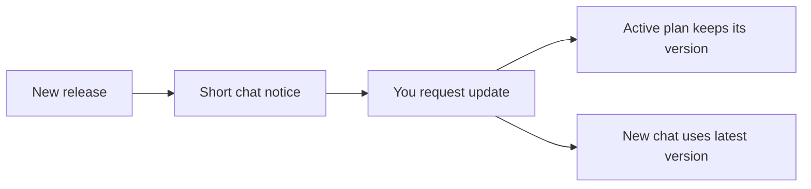

<picture>
  <source media="(max-width: 800px)" srcset="docs/assets/cover-mobile.svg">
  
</picture>

# C2C — planning with Codex and Claude Code

**Plan software, content, or both. Challenge decisions and choose where to start.** Use Codex, Claude Code, or both.

[](https://github.com/ZiadHassanein/C2C/actions/workflows/test.yml)

[**Version 2.5.0**](CHANGELOG.md) · **Windows · Linux · macOS** · **Node.js 18+** · **No npm dependencies** · [**MIT license**](LICENSE)

[Install](#install) · [First request](#use-it) · [Your plan](#what-you-receive) · [Workflow](#how-it-works) · [Update](#update) · [Uninstall](#uninstall) · [Help](#need-help)

<details>
<summary>What C2C does and who coordinates</summary>

**A planning skill that turns your brief into a plan with evidence-based critique.** C2C checks the project, asks important questions, compares proposals, and records decisions, relevant risks, acceptance checks, and a clear starting point for execution.

Start in **Codex with `$C2C`** or **Claude Code with `/C2C`**. **The chat you start coordinates the work.** Either provider can lead, and your chat model stays unchanged.

**Use what is already available.** C2C prefers an eligible Codex–Claude exchange. If the other provider is unavailable before calls, it selects a planning model and a distinct critic suited to the task from the current provider, within your limits. If that route is unavailable too, it produces a provisional plan with a structured self-critique. Setup is optional; missing reviews are never invented.

</details>

## Install

**One command. No Git or global installation.** Requires [Node.js 18+ with npm/npx](https://nodejs.org/en/download).

Run in **PowerShell on Windows** or **Terminal on macOS/Linux**:

```sh
npx --yes https://github.com/ZiadHassanein/C2C/archive/refs/tags/v2.5.0.tar.gz install
```

Installs the skill for your current user in both apps. Start a new chat afterward. [One app only](docs/SETUP.md#install-for-one-app-only) · [Easy to uninstall](#uninstall).

<!-- Keep existing section links on the visible disclosure. -->
<a name="1-prepare-your-tools"></a>
<a name="2-install-and-check"></a>

<details>
<summary>Setup checks, optional CLI sign-in, Git/ZIP installation and help</summary>

**Easy to remove.** Finish or stop active C2C runs, then use the [uninstall command](#uninstall). It moves unchanged managed skill folders into recoverable backups. Customized or unrecognized folders are protected; [manual removal](docs/SETUP.md#manual-removal) remains available. Your projects and plans saved elsewhere stay in place.

**1. Prepare your tools**

[Node.js 18 or newer](https://nodejs.org/en/download) runs the setup and council scripts; the quick command also needs npm/npx. No npm account is needed. C2C uses existing compatible, authenticated command-line tools (CLIs) for independent review. If you want to add one, these are the optional setup instructions:

| Tool | Official installation guide | Sign in if needed |
|---|---|---|
| Codex CLI | [Install Codex](https://learn.chatgpt.com/docs/codex/cli) | `codex login` |
| Claude Code CLI | [Install Claude Code](https://code.claude.com/docs/en/quickstart) | `claude auth login` |

**You do not need the other app or a second terminal open.** C2C starts background workers using saved CLI authentication. The skill installer does not install these tools or sign you in.

### Can I use only one CLI?

Yes. A Codex-only exchange needs a ready Codex CLI and two eligible, distinct models; a Claude-only exchange needs the equivalent Claude setup. C2C selects this route automatically when the other provider is unavailable before calls, or when you request it. It uses real model responses: the coordinator evaluates critiques and revises the plan; the reviewer checks those decisions during verification.

For a cross-provider exchange, only the peer's CLI is needed when your chat is the selected author; a background author requires both CLIs. If no eligible two-participant route exists, the chat delivers a provisional plan with a clearly labeled self-critique, relevant security and acceptance checks, and an execution entry point. [Choose the participants](docs/SETUP.md#choose-the-participants).


**2. Install and check**

Prefer a local copy? With Git installed:

```sh
git clone https://github.com/ZiadHassanein/C2C.git
cd C2C
node scripts/setup.mjs install
node scripts/setup.mjs doctor
```

No `npm install` is needed. Without Git, [download the ZIP](https://github.com/ZiadHassanein/C2C/archive/refs/tags/v2.5.0.zip), extract it, and run the two `node` commands from the folder containing `scripts`. Local setup works without npm/npx or a network connection once the source is downloaded. The original `node scripts/install.mjs` and `node scripts/council.mjs doctor` commands remain supported.

For the quick-install route, check setup from any folder:

```sh
npx --yes https://github.com/ZiadHassanein/C2C/archive/refs/tags/v2.5.0.tar.gz doctor
```

For the default setup with both CLIs, look for:

```json
{
  "codex_chat_ready": true,
  "claude_chat_ready": true
}
```

`doctor` checks CLI compatibility, saved authentication and the nonsecret account route without a model call. It also reports same-provider readiness. Unknown quota is not a provider failure; your [usage restrictions](references/protocol.md#no-paid-limit-recovery) still apply. C2C previews the selected review packet before launch and distinguishes local permission errors from provider failures. [Troubleshooting](docs/SETUP.md#troubleshooting) · [npx / PowerShell help](docs/SETUP.md#npx-and-powershell-help) · [One app only](docs/SETUP.md#install-for-one-app-only)

</details>

## Use it

**Open your project in Codex or Claude Code and start a new chat.** Paste one of these prompts into that chat—not the terminal:

### From Codex

```text
Use $C2C to plan a search filter for this app.
Check the project first, include security and acceptance tests,
and show me the plan before coding.
```

### From Claude Code

```text
/C2C Plan a search filter for this app.
Check the project first, include security and acceptance tests,
and show me the plan before coding.
```

| Your task | What the review emphasizes |
|---|---|
| **Software** — a feature, fix, or app | Engineering choices, failure paths, security and tests. |
| **Content** — website copy, educational material, or images | Audience, structure, factual sources, rights, accessibility and editorial acceptance checks. |
| **Mixed** — an app and its content | Both perspectives, with dependencies and separate technical and content checks. |
| **Developer QA** — a change, regression, or release decision | Authorized tests, negative cases and observed evidence; missing or failed checks remain visible. |

For testing: `Use $C2C to review this change, run the authorized local tests, and give me a revised fix plan with the evidence.` Use `/C2C` in Claude Code. [QA workflow and examples](docs/QA.md) · [Shared spending preference](docs/SETUP.md#save-your-spending-preference)

<details>
<summary>Examples: content and mixed projects</summary>

```text
Use $C2C to plan improvements to this website's copy,
educational articles, and supporting images. Check the audience,
sources, image rights, and accessibility before proposing changes.
```

```text
/C2C Plan a learning app and its first lesson, onboarding copy,
and illustrations. Coordinate the software and content milestones,
with acceptance checks for both and a clear first step.
```

Either example works in either app: use `Use $C2C` in Codex or `/C2C` in Claude Code. C2C delivers the plan; writing final content, generating images, implementing, or publishing needs its own authorization. Workers receive text evidence: the coordinator inspects authorized images when possible and supplies descriptions, source and rights facts, or explicit unknowns. [Content and image review](docs/FAQ.md#can-c2c-plan-content-and-image-work).

</details>

<details>
<summary>How C2C chooses participants and respects your preferences</summary>

Replace the example with your task. C2C assesses the project, clarifies consequential unknowns, selects suitable workers within your limits, and runs the exchange. You do not fill in assessment files yourself.

| Start here | Both providers eligible | Other provider unavailable before calls |
|---|---|---|
| Codex: `$C2C` | Codex planner + Claude reviewer | Codex planner + distinct Codex critic |
| Claude Code: `/C2C` | Claude planner + Codex reviewer | Claude planner + distinct Claude critic |

The critic uses an engineering perspective for software, an editorial and factual perspective for content, and both for mixed work.

Each route needs the required CLI workers, eligible exact models and known authorized allowance. If those checks fail, the chat uses a provisional plan with a structured self-critique. Requests to require both providers, wait, pin participants/models or give advice only take precedence. [Routing and recovery](references/protocol.md#planning-with-unavailable-tools).

</details>

<details>
<summary>Example: plan a whole project</summary>

```text
Use $C2C to plan an ecommerce website for selling cars.
Customers need browse/filter, photos, car details, and seller contact.
I need an admin dashboard to manage inventory.
Start with a sensible MVP, include security and testing,
and show me the milestones and first implementation step before coding.
```

In Claude Code, replace `Use $C2C` with `/C2C`.

</details>

<details>
<summary>Example: review an existing plan</summary>

```text
Use $C2C to review docs/plan.md against this project.
Challenge assumptions and proposed fixes with evidence.
Show the recommended changes, unresolved risks, and where to start.
```

Replace the path with your plan. In Claude Code, start with `/C2C`.

</details>

<!-- Keep existing section links on the visible disclosure. -->
<a name="with-codex-only-or-claude-only"></a>

<details>
<summary>With Codex only or Claude only</summary>

**With Codex only or Claude only**

```text
Use $C2C with Codex only to plan this feature.
Choose a planning model and a different engineering reviewer within my limits.
```

```text
/C2C Use Claude only to review this educational content plan.
Choose a planning author and a different editorial and factual critic within my limits.
```

C2C can also select this route automatically when the other provider is unavailable before calls. It researches current model and compatible effort settings for each new task, honors your choices, and records requested settings separately from provider-confirmed details. It does not change your chat model or global settings. Different models do not prove independent reasoning. [Model selection](references/model-selection.md).

The planner connects goals, constraints and tradeoffs to a workable approach. The critic checks proposed decisions and fixes against the task's evidence and failure cases. In independent plan mode, each first develops its own proposal. The coordinator resolves findings and the reviewer verifies those decisions. This uses the existing stages and call allowance; it does not imitate another provider or add debate for its own sake. [Single-provider perspectives](references/protocol.md#single-provider-planning-perspectives).

For recommendations without worker calls, ask: **“Assess the task and recommend models; advice only.”**

The goal is better decisions for the work spent. Review can cost more than ordinary planning; accuracy, time and token improvements require a [matched comparison](docs/BENCHMARKS.md#what-counts-as-improvement), not a longer discussion.

</details>

## How it works

**Start in either app. C2C uses the eligible route within your limits.**

<picture>
  <source media="(max-width: 640px)" srcset="docs/assets/situations-mobile.svg">
  
</picture>

<details>
<summary>See the full planning and review workflow</summary>

<picture>
  <source media="(max-width: 640px)" srcset="docs/assets/workflow-mobile.svg">
  
</picture>

**Independent planning** compares separate proposals. **Focused review** starts from one candidate plan. Both include critique, synthesis, security review, and verification. The final revision check receives a compact change comparison alongside the full plan and evidence. Planner and reviewer can use different providers or distinct models within either app. A provisional self-critique does not claim this completed exchange.

</details>

<!-- Keep existing section links on the visible disclosure. -->
<a name="before-planning"></a>

<details>
<summary>What C2C checks before planning</summary>

**Before planning**

C2C checks what exists, whether it is deployed or published, what readiness evidence is available, and whether the goal and first useful action are clear. Content work also needs its audience, purpose, source material and acceptance criteria. Missing evidence stays unknown. Bounded tasks get a focused assessment; project roadmaps get release boundaries and dependent milestones. [Assessment details](references/project-assessment.md).

</details>

<details>
<summary>If the other provider becomes unavailable during a run</summary>

<picture>
  <source media="(max-width: 640px)" srcset="docs/assets/recovery-mobile.svg">
  
</picture>

A timeout or login failure is not proof of exhausted quota. Inspect the cause first; timeouts can use [bounded recovery on the same run](docs/SETUP.md#when-a-peer-call-takes-longer). The diagram covers an unavailable opposite provider, not unrestricted switching after any failure. [Recovery rules](references/protocol.md#planning-with-unavailable-tools) · [Usage limits](docs/SETUP.md#when-a-participant-hits-a-usage-limit).

</details>

<!-- Keep existing section links on the visible disclosure. -->
<a name="follow-the-discussion"></a>

<details>
<summary>Follow the discussion: proposals, critiques and decisions</summary>

**Follow the discussion**

Open `final-plan.md` for the revised plan with fixes applied. Open the separate `DISCUSSION.md` for a compact concern → proposed change → decision record. Full arguments and evidence are linked rather than repeated; an ellipsis marks an excerpt. Chat stays focused on questions, blockers and the final brief. To receive chat summaries too, ask: “Show me the main disagreements and plan changes as you go.”

**Illustrative car-site discussion—not a recorded exchange:**

| Contribution | Decision |
|---|---|
| One proposal includes customer accounts and saved cars. | Candidate MVP scope. |
| The reviewer asks whether browsing and seller contact need accounts. | Challenges the additional launch work. |
| The coordinator keeps inventory administration authenticated and defers customer accounts. | Records the smaller scope and its reason. |

Actual participants can agree or disagree. Reviewers test assumptions with evidence, counterexamples and alternatives. The coordinator records its response to each finding; the reviewer answers material counterarguments during verification. C2C evaluates remedies as well as objections. It does not force disagreement or invent replies. Failed and missing reviews stay visible. The file contains report summaries, findings and recorded decisions, not private reasoning. [Discussion controls](docs/SETUP.md#follow-the-discussion).

</details>

## What you receive

**Open `final-plan.md` first.** After a run completes, the final reply links directly to all three files:

| File | What to look for |
|---|---|
| **`final-plan.md`** | The usable plan with accepted fixes incorporated: scope, decisions, steps, security, checks and **Start here**. Reviewing an existing plan produces its revised version, unless you request critique only. |
| **`DISCUSSION.md`** | A separate, compact review record: concerns, proposed changes, decisions and unresolved questions, with links to the full evidence. |
| **`RESULT.md`** | The completion record: review outcome, unresolved issues and whether the delivered revision was reviewed. Completion does not guarantee agreement or readiness. |

Before completion, the chat links the available plan and discussion and explains that `RESULT.md` is not generated yet. If no eligible worker route can be prepared, you receive one standalone provisional plan with clearly labeled self-critique instead. C2C does not create a completion report for an unfinished exchange.

<details>
<summary>Inside the plan: scope, decisions, risks, checks and Start here</summary>

A typical plan is organized like this; bounded tasks keep the same essentials concise:

```text
Review status and recommendation
Scope: MVP and deferred work
Key decisions and tradeoffs
Steps or milestones, dependencies and acceptance checks
Relevant security, source/rights checks, tests and unresolved risks
Start here: first task, location, prerequisites and success check
Execution model recommendation, alternative and savings evidence
```

Project evidence, model choices and resumable progress remain in `PROJECT_CONTEXT.md`, `TASK_ASSESSMENT.md` and `HANDOFF.md`. Unknown paths become bounded discovery tasks. Content plans use editorial, factual, rights and accessibility checks where relevant; they do not require software test commands. Planning completion does not authorize implementation, content production or publication, or establish readiness. [Plan layout](references/plan-presentation.md).

Material dependencies can be recorded in a small optional map inside the existing `decisions.json`: requirement → evidence or assumption → decision → step → check. It helps detect missing links and cycles without adding a deliverable. Unknown facts gate affected actions; recorded links do not prove the plan correct. [Traceability and checks](references/protocol.md#optional-plan-map).

</details>

<!-- Keep existing section links on the visible disclosure. -->
<a name="which-model-should-execute-the-plan"></a>

<details>
<summary>Execution models: recommendations, reasons and savings evidence</summary>

**Which model should execute the plan?**

C2C recommends a model for the first execution task, with a lower-cost alternative when justified, a reason to reconsider it, and dated sources. It reuses current official research and checks relevant firsthand community reports. Software, editorial and image work can need different choices; there is no permanent best model. Recommendations do not switch your model or start execution.

The explanation comes first: **why this model fits your task, why choose it over the alternative, what the tradeoff is, and what check could change the decision**. Any saving also gets a reason, such as lower published token prices or measured lower usage; price alone does not prove fewer tokens or better results.

Savings are labeled separately: **task tokens**, **equal-token API price estimate**, and **subscription allowance**. A cheaper price does not mean fewer tokens or equal quality. Unsupported percentages stay **unknown**. [Execution advice and evidence rules](references/model-selection.md#recommend-models-for-execution).

You can ask: “Recommend an execution model for each milestone within my included allowance. Show sourced savings where supported and mark unknowns.”

</details>

## Features

**Relevant checks, model research, saved progress and bounded recovery.** Worker calls use your provider allowance. Keep secrets out of selected context; attempt/time limits are not spending caps. C2C does not buy credits or change billing to bypass a limit.

<details>
<summary>All features, privacy, usage limits and evidence boundaries</summary>

| Capability | What it changes for your plan |
|---|---|
| **Current model research** | Selects suitable planning/review workers within your limits, with recorded reasons. |
| **Missing-evidence requests** | Lets reviewers ask for facts; scoped snapshots or explicit unavailable/rejected answers are recorded. |
| **Final-revision checks** | Checks consequential corrections once within the existing allowance, or marks the revision unreviewed. |
| **Dependency checks** | Finds structural gaps in an optional plan map and identifies potentially affected steps after revisions, while retaining the full current plan and evidence. |
| **Scoped usage reporting** | Shows observed worker terminal usage and unknown counters; coordinator work, total-task savings and subscription cost remain unknown. |
| **Available-provider routing** | Prefers eligible cross-provider review, then distinct models in the starting provider before calls. If no route qualifies, delivers a provisional plan with self-critique. |
| **Usage-limit recovery** | Preserves actual reports and used allowance; follows bounded recovery or finishes provisionally. No paid credits or account/billing changes. |
| **Waits for active work** | Meaningful model activity renews the inactivity guard. No fixed total deadline by default; explicit caps and provider limits still apply. [How waiting works](docs/SETUP.md#when-a-peer-call-takes-longer). |
| **Saved progress** | Preserves completed stages and attempts so an interrupted exchange can resume within its allowance. |
| **Update notices and stable plans** | Announces new releases, updates on request and retains the active run's C2C version and instructions. Protects local edits and keeps rollback backups. |

Worker calls use your provider account and usage limits. Only selected context is sent; exclude secrets and unrelated private material. Attempt/time ceilings are **not spending caps**. A completed exchange may retain unresolved issues or an explicitly unreviewed final revision; missing required stages leave it incomplete. [Usage, limits and privacy](docs/SETUP.md#usage-and-privacy).

Runtime tests and synthetic input benchmarks do not prove better plans, lower total cost or faster responses. See the [evaluation methods](docs/BENCHMARKS.md) for how these can be assessed separately.

The coordinator can load applicable instruction sections with `guide` and inspect a run with `quality --run RUN` or `usage --run RUN`, without a model call. Full worker context remains the default. Experimental `--context-profile verify-compact` only replaces whole proposals exactly repeated in the current plan with explicit references when the packet gets smaller; it makes no token-saving or quality claim. [Technical behavior and limits](references/protocol.md#token-efficiency).

C2C does not buy credits or switch to paid billing when a provider limit blocks planning. Any continuation stays within existing authorized limits; otherwise it delivers a provisional plan or saves a checkpoint. [Billing boundaries](docs/FAQ.md#will-c2c-buy-credits-or-require-paid-usage-after-a-limit).

</details>

## Update

When you use C2C, it checks for new releases at most daily and gives a short chat notice. Say **“Update C2C and keep this plan on its current version.”** Or run:

```sh
npx --yes https://github.com/ZiadHassanein/C2C/archive/refs/tags/v2.5.0.tar.gz update
```

The updater installs the latest stable release. Plans prepared with 1.4+ keep their original runtime and instructions; start a new chat for new-version plans. Older or provisional plans should finish or stop first. [Checks, offline updates and rollback](docs/SETUP.md#update-the-skill).

<details>
<summary>What happens to a plan during an update?</summary>



No automatic installation or extra model call. Completed reviews, decisions and usage limits stay with the current run. Checks can be disabled; updates retain recoverable backups and protect local edits.

</details>

## Uninstall

Finish or stop active C2C runs, then run:

```sh
npx --yes https://github.com/ZiadHassanein/C2C/archive/refs/tags/v2.5.0.tar.gz uninstall
```

Moves unchanged managed skill folders into recoverable backups. Your projects, apps and logins stay in place. Start a new chat afterward. Add `--dry-run` to preview, or `--target codex` / `--target claude` for one app. [Restore, offline or manual removal](docs/SETUP.md#uninstall).

## Need help?

<details>
<summary>C2C is missing, a CLI is unavailable, or a call stops</summary>

| Problem | Next step |
|---|---|
| C2C does not appear | Start a new chat after installation; check [setup and discovery](docs/SETUP.md#troubleshooting). |
| CLI missing, incompatible or signed out | Follow the reported `doctor` guidance and [setup checks](docs/SETUP.md#check-your-setup). |
| A call stops waiting | Ask C2C to distinguish missing observed activity, an explicit time cap or a provider failure, then [inspect and resume the saved run](docs/SETUP.md#when-a-peer-call-takes-longer). |
| A provider hits its usage limit | Follow [bounded continuation or provisional planning](docs/SETUP.md#when-a-participant-hits-a-usage-limit), or explicitly ask to wait for both participants. |

</details>

## Documentation

<details>
<summary>Setup, FAQ, evaluation, release notes and agent instructions</summary>

| Guide | Purpose |
|---|---|
| [Setup and troubleshooting](docs/SETUP.md) | Install, update, roll back or uninstall; platform requirements and recovery. |
| [FAQ](docs/FAQ.md) | Models, costs, security, discussion and planning behavior. |
| [Evaluation methods](docs/BENCHMARKS.md) | How to measure inputs, planning quality and resource use. |
| [Visual guide — historical v0.7 PDF](docs/C2C-LinkedIn-Guide.pdf) | Illustrated cross-provider setup; use this README for current features. |
| [Release notes](CHANGELOG.md) | Changes by version. |
| [Agent instructions](SKILL.md) · [Protocol](references/protocol.md) · [Project notes](PROJECT_NOTES.md) | Coordination rules, commands, schemas and development evidence. |

</details>

---

Built for Codex and Claude Code. Distributed under the [MIT license](LICENSE); third-party marks retain their own rights. [Logo credits](docs/assets/ATTRIBUTION.md).
