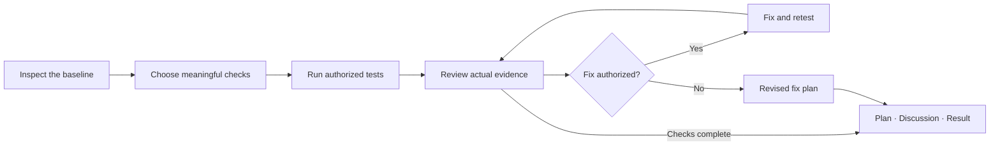

# QA planning and verification

[← Quick start](../README.md) · [Setup](SETUP.md) · [FAQ](FAQ.md)

C2C can plan checks, review an implementation and help verify an authorized fix. Your request to run the relevant tests authorizes the coordinating AI to execute them and review their evidence within that scope and the host's permissions. Peer workers review the supplied code, receipts and results as text; they do not run project tests themselves.

The loop represents scoped retesting after a real correction, not additional peer calls to force agreement. Planning-only requests keep checks proposed. If no eligible peer can run, the chat delivers an honestly provisional plan.

## Ask for the outcome you need

For a small fix:

> Use C2C to review this fix, run the relevant existing local tests, and verify the failing behavior is corrected. Preserve unrelated changes and report anything still untested.

For planning without execution:

> Use C2C to plan verification for this feature. Connect its important risks to acceptance checks and identify the first testable milestone. Do not implement it yet.

For mixed work:

> Use C2C to review this page's behavior and content, run the authorized local checks, and identify remaining source, accessibility and integration gaps.

A narrow task should receive a narrow check. A larger or consequential change may need unit, integration, contract or end-to-end tests, plus relevant negative, concurrency, migration or accessibility checks. C2C uses the existing stack where practical; it does not require every category or a new test framework. Content work can use factual, editorial, permission and audience checks instead of software commands.

## What counts as evidence

The coordinator records which revision and uncommitted changes were inspected, the command or manual method, environment, observation time, actual result, and relevant logs or excerpts with their hashes. It preserves failing attempts, skips and blockers. A green result obtained by weakening assertions or silently ignoring a failure is not acceptable evidence.

| Reported state | Meaning |
|---|---|
| Static inspection | Relevant source or supplied material was examined; the application was not necessarily executed. |
| Proposed | A useful check is described but has not run. |
| Executed | The actual run or manual check has a recorded pass/fail result and supporting evidence. |
| Blocked | A named constraint prevented the check; the missing evidence and next action are visible. |

An offline fixture establishes only the behavior it exercises. It cannot establish live account access, provider billing, production performance or complete security. The coordinator does not use production data, load tests, destructive operations, paid services, deployment or publication beyond your authorization. Ordinary authorized local testing and retesting do not require repeated approval.

## Read the plan and result

`final-plan.md` holds the current recommendation, operative steps and acceptance checks. `DISCUSSION.md` shows actual findings and their dispositions; `RESULT.md` records the outcome and remaining limits. Detailed receipts stay in existing evidence or the plan appendix. You do not need to create a separate QA report.

For a requested QA council, the coordinator adds `--purpose qa` to its normal `prepare` command. This sealed purpose requires an assurance record in the existing `decisions.json` before verification and finish. It connects the chosen option, accepted findings and material checks to exact plan passages and supplied evidence. The default planning purpose keeps this record optional; neither option grants additional execution authority.

`quality --run RUN` checks the recorded links and hashes. Proposed or blocked tests stay unexecuted in the record, and `ready_for_review` describes readiness to inspect it. It does not mean the implementation is ready for production or the content is ready to publish.

After a fix, C2C verifies the failed behavior and affected regressions, then gives the next supported step with remaining gaps. A completed peer discussion is distinct from a working implementation or authorized release. See the [developer QA reference](../references/developer-qa.md) for evidence, contract and retest details.
